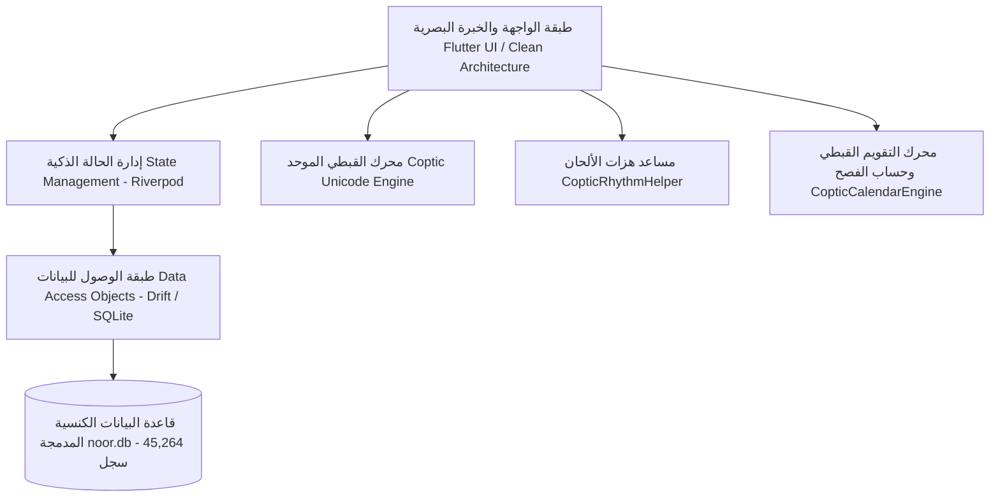

# 🏛️ الخطة الشاملة لتطبيق نور من الصفر للبرودكشن
## Noor Coptic Orthodox Master Architecture & Production Plan
**المطور الرئيسي:** Geovany Elhawy  
**الإصدار الكنسي الكبير المعتمد:** 2.2.0 (Grand Ecclesiastical Release)  
**الهوية:** تطبيق مسيحي أرثوذكسي قبطي شامل، مجاني، بدون إعلانات، يعمل أوفلاين سيادياً بنسبة 100%.

---

## ١. الرؤية المعمارية والكنسية (Core Architectural Vision)

تم تصميم وبناء تطبيق **نور (Noor)** ليكون المرجع الكنسي الرقمي الأرثوذكسي الأكثر دقة وشمولاً وموثوقية في العالم الرقمي. يعتمد التطبيق على مبدأ **السيادة التامة في العمل أوفلاين (Sovereign Offline Architecture)**، حيث تم تضمين جميع النصوص الطقسية والكتب المقدسة والسنكسار والقطمارس والمذكرات الطقسية داخل قاعدة بيانات محلية مدمجة (`SQLite` بحجم يتجاوز 45 ألف سجل)، دون الاعتماد على أي خوادم خارجية أو إنترنت.

---

## ٢. هيكلية البيانات الكنسية والمصادر المعتمدة

| القسم الكنسي | الجدول في قاعدة البيانات | عدد السجلات | المرجع الكنسي المعتمد |
|---|---|---|---|
| **الكتاب المقدس** | `bible_books`, `bible_verses` | ٧٣ سفراً • ٣١,١٠٢ آية | ترجمة فاندايك البيروتية + الأسفار القانونية الثانية لبطريركية الأقباط الأرثوذكس ومزمور ١٥١ |
| **الخولاجي المقدس** | `liturgies`, `liturgy_sections`, `liturgy_parts` | ٧٢٧ قسماً ومردّاً | طبعة دير السيدة العذراء المحرق الرابعة المعتمدة برئاسة قداسة البابا شنودة الثالث ونيافة الأنبا ساويرس |
| **الأجبية المقدسة** | `agpeya_hours`, `agpeya_sections` | ٧ سواعي + الستار | طبعات دير السريان العامر ودير القديس أنبا مقار |
| **موسوعة الألحان** | `hymn_books`, `hymns`, `hymn_segments` | ٤ أجزاء • ١٨ باباً • ٦٣ لحناً • مقاطع الهزات | سلسلة مذكرات الألحان بالهزات للدياكون أسامة لطفي |
| **صلوات أسبوع الآلام** | `pascha_readings` | ٦١٥ فصلاً وقراءة | كتاب البصخة المقدسة لقطمارس أسبوع البصخة المعتمد |
| **القطمارس الكنسي** | `katameros_readings` | آلاف القراءات السنوية والموسمية | قطمارس الكنيسة القبطية الأرثوذكسية |
| **السنكسار والآباء** | `synaxarium_entries`, `saints` | ١٣ شهراً قبطياً كاملاً | طبعة دير السريان العامر برئاسة المتنيح الأنبا إيسوذوروس |
| **الدفنار والتسابيح** | `difnar_entries` | كافة أرباع الدفنار | كتاب الدفنار الطقسي لشهور السنة |
| **الأسرار السبعة** | `sacraments`, `sacrament_sections` | صلوات وطقوس الأسرار الـ ٧ | كتاب أسرار الكنيسة السبعة الطقسي |

---

## ٣. مراحل المراجعة والتنفيذ السبع (The 7 Execution Stages)

### المرحلة الأولى: مراجعة القبطي وتوحيد الترميز (Coptic Unicode Standardization)
- إخضاع كافة النصوص القبطية في قاعدة البيانات والشفرة المصدرية لمعيار **Coptic Unicode Block (`U+2C80`–`U+2CFF`)**.
- تطهير المشروع من ترميزات الخطوط القديمة (Athanasius ASCII Font Hacks).
- تدقيق وضع علامة الجِنكِم (`\u0300`) فوق الحرف الساكن المستحق وفق قواعد اللغة القبطية البحيرية.
- النتيجة: **١,٦٣٨ سجلاً قبطياً معتمداً** وصفر محارف غير قياسية.

### المرحلة الثانية: مكتبة الألحان بالهزات (Deacon Osama Lotfy Hymns Structure)
- هيكلة المنهج التعليمي إلى **٤ أجزاء طقسية رئيسية و١٨ باباً**:
  - الجزء الأول: الألحان السنوية (عشية وباكر، القداس، الصوم الكبير، ختام الصوم والشعانين، القيامة والخماسين).
  - الجزء الثاني: الألحان الفرايحي (الأعياد السيدية الكبرى والصغرى والصليب وصوم وعيد العذراء والرسل).
  - الجزء الثالث: الألحان الحزايني (أسبوع الآلام، صلوات البصخة، خميس العهد، الجمعة العظيمة، وسبت الفرح أبو غلمسيس).
  - الجزء الرابع: ألحان كيهك (تسبحة كيهك ٧ و٤، مدائح كيهك، وسهرات كيهك المباركة).
- تضمين: النص القبطي، النطق المعرب، المعنى العربي، وتجزئة الهزات بنظام `syllables_json` مع مساعد المسرع والتمبو الصوتي (`CopticRhythmHelper`).

### المرحلة الثالثة: ضبط وتبسيط شاشة الإعدادات (Settings Optimization)
- حصر الإعدادات في **٥ أقسام رئيسية محددة فقط** على شاشة واحدة بدون صفحات فرعية معقدة:
  1. القراءة والخط (Slider حجم الخط + معاينة حية + تثبيت إضاءة الشاشة).
  2. المظهر والخطوط (أوضاع العرض: تلقائي، فاتح، داكن، سيبيا، وأسود OLED).
  3. التذكيرات والصلوات (تنبيهات صلوات الأجبية + الآية اليومية وتنبيهات الأصوام).
  4. المحتوى واللغة (إظهار التشكيل + عرض النص القبطي والتعريب).
  5. المفضلة والبيانات (تصدير واستيراد المفضلة للحافظة + المصادر الكنسية + إعادة الضبط + كارت التوثيق للمطور **Geovany Elhawy**).

### المرحلة الرابعة: مراجعة النصوص والمصادر (Ecclesiastical Cross-Check)
- مطابقة كل سفر وآية ومرد كنسي مع الطبعات المعتمدة للأديرة القبطية.
- إصدار وثيقة التقرير الكنسي الشامل `REVIEW_REPORT.md`.

### المرحلة الخامسة: مراجعة الأزرار والواجهات (Buttons & UI/UX Audit)
- تدقيق القائمة السريعة `AppQuickMenu` وإتاحتها في كافة الشاشات.
- إضافة وظائف: "مشاركة التطبيق"، "الإبلاغ عن ملاحظة كنسية"، و"تصدير واستيراد المحفوظات".
- توفير أداة عداد الترتيل التفاعلية (١٢ مرة) في صلوات البصخة لترتيل "ثوك تي تي جوم".

### المرحلة السادسة: مراجعة الشفرة المصدرية والأمان (Code Quality & Security)
- صفر استدعاءات `print()` واستخدام `LoggerService`.
- صفر طلبات إنترنت خارجية أو أذونات غير مبررة (استقلال تام أوفلاين).
- اجتياز الفحص الثابت (`flutter analyze`: **0 issues**).
- اجتياز جميع اختبارات الوحدة والواجهات (`flutter test`: **117 / 117 tests passed**).

### المرحلة السابعة: إصدار الإنتاج والتوثيق (Release & Documentation)
- إصدار ملفات التوثيق الرسمية: `REVIEW_REPORT.md` و `FINAL_PLAN.md` و `CHECKLIST.md`.
- بناء ملف التثبيت المعتمد: `Noor_v2.2.0_Grand_Ecclesiastical_Release.apk`.
- توفير سكربت التحديث السريع عبر USB أو كابل الهاتف: `update_phone.bat`.

---

## ٤. مواصفات الأداء والإنتاج (Production Specs)

- **حجم قاعدة البيانات:** ~25 ميجابايت (مضغوطة وعالية الفهرسة بالمؤشرات Indices).
- **سرعة الإقلاع وفتح الشاشات:** أقل من 0.4 ثانية (Direct Native SQLite Queries via SQLite3 C-engine).
- **التوافق:** أندرويد 6.0 وما فوق (API 23+) حتى أحدث إصدارات أندرويد 15+.
- **التحديث والصيانة:** إدارة سلسة عبر التخزين الداخلي ودون المساس بمفضلات المستخدم عند التحديث.
